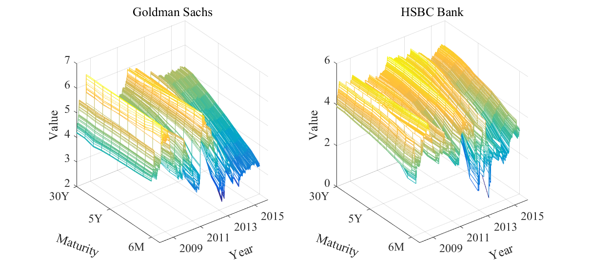
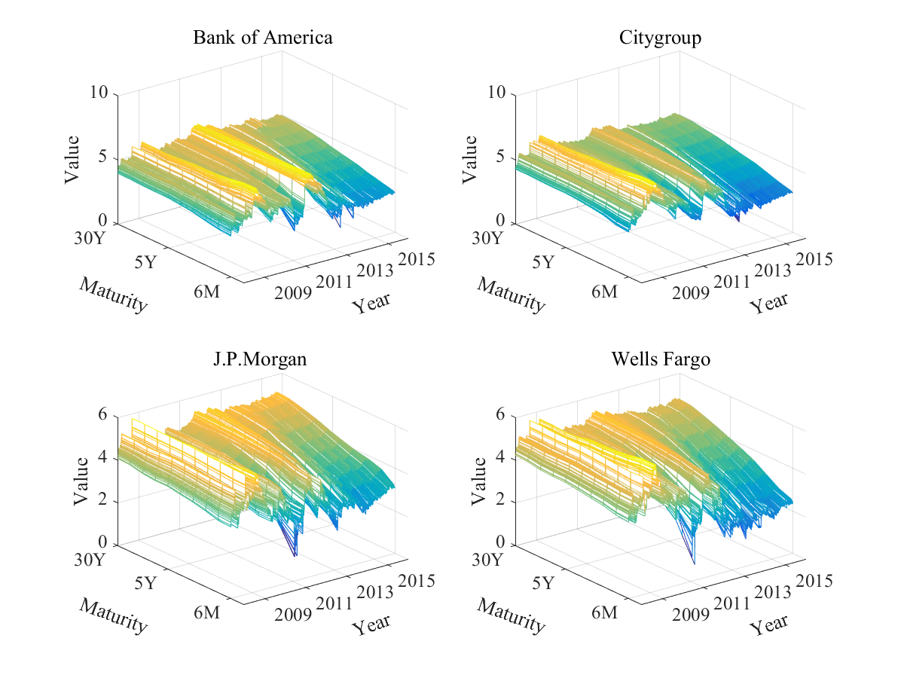
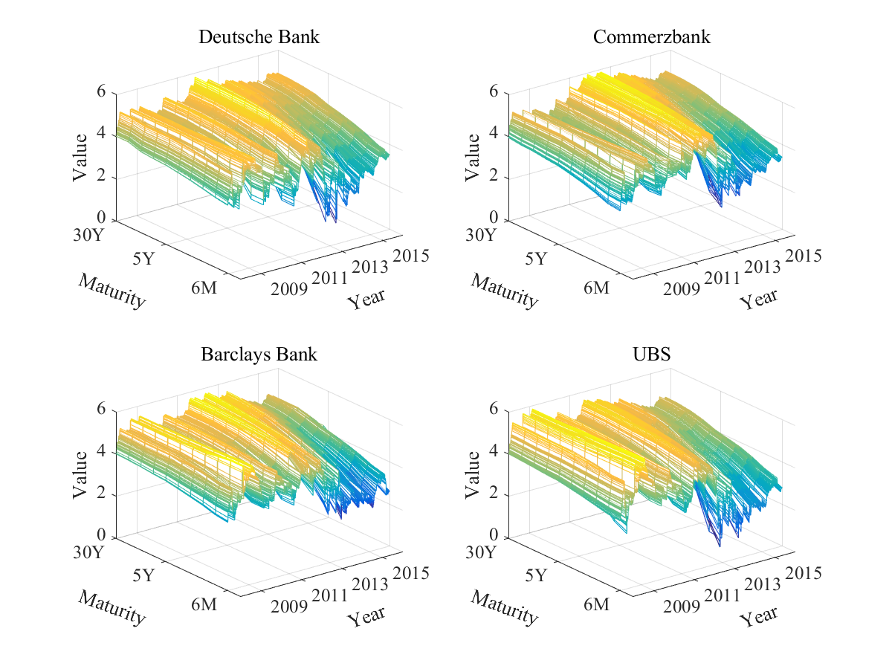

[](http://quantlet.de/)

## [](http://quantlet.de/) **DDINetwork_CDS** [](http://quantlet.de/)

```yaml

Name of Quantlet : DDINetwork_CDS

Published in : DDINetwork

Description : Plot the 3D CDS curves of the selected 10 banks.

Keywords : data visualization, 3D, term structure, plot, default

See also : 'DDINetwork_CDS_forecast, DDINetwork_network_dynamic, DDINetwork_network_static,
DDINetwork_network_US_EU'

Author : Xiu Xu

Submitted : Tue, Dec 27 2016 by Xiu Xu

Datafile : Bank.xlsx

```








### MATLAB Code:
```matlab
clear all;  
clc;

firmnum  = 10;
Bankname = [
            'Bank of America';
            '   Citygroup   ';
            ' Goldman Sachs ';
            '  J.P.Morgan   ';
            '  Wells Fargo  ';
            ' Deutsche Bank ';
            '  Commerzbank  ';
            ' Barclays Bank ';
            '   HSBC Bank   ';
            '      UBS      '
            ];
figure
bank = [3 9];
for i = 1 : length(bank)
    k         = bank(i);
    [data, d] = xlsread('Bank.xlsx', ['Bank_' num2str(k)], 'A4:K2091'); 
    CDS       = log(data);
    bname     = Bankname(k, :);
    subplot(1, 2, i)
    CDSPlot(CDS', bname)
end
saveas(gcf, 'CDS1', 'png');

figure
banks = [1 2 4 5];
for i = 1 : 4
    k         = banks(i);
    [data, d] = xlsread('Bank.xlsx', ['Bank_' num2str(k)], 'A4:K2091'); 
    CDS       = log(data);
    bname     = Bankname(k, :);
    subplot(2, 2, i)
    CDSPlot(CDS', bname)
end
saveas(gcf, 'CDS2', 'png');

figure
banks = [6 7 8 10];
for i = 1 : 4
    k         = banks(i);
    [data, d] = xlsread('Bank.xlsx', ['Bank_' num2str(k)], 'A4:K2091'); 
    CDS       = log(data);
    bname     = Bankname(k, :);
    subplot(2, 2, i)
    CDSPlot(CDS', bname)
end
saveas(gcf, 'CDS3', 'png');
```
