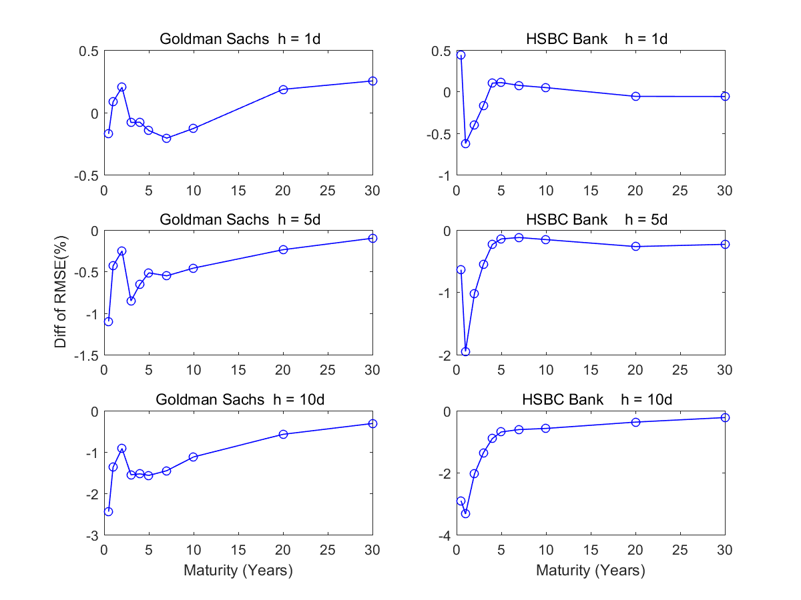

[](http://quantlet.de/)

## [](http://quantlet.de/) **DDINetwork_CDS_forecast** [](http://quantlet.de/)

```yaml

Name of Quantlet : DDINetwork_CDS_forecast

Published in : DDINetwork

Description : 'Forecast CDS spreads with network information in 2011-2013 under DNS model, and
calculate the difference of RMSE between DNS model with or without other bank information. Further,
perform a DM test to compare the out-of-sample performance.'

Keywords : 'factor analysis, factor-model, forecast, factor, term structure, plot, parameter, pca,
autoregressive, default, estimation, regression, multivariate analysis'

See also : 'DDINetwork_CDS, DDINetwork_network_dynamic, DDINetwork_network_static,
DDINetwork_network_US_EU'

Author : Xiu Xu

Submitted : Tue, Dec 27 2016 by Xiu Xu

Datafile : Bank.xlsx

```




### MATLAB Code:
```matlab
%% Forecast
clear all;  clc;
% read data
matname  = ['  m06';'  y01'; '  y02';'  y03';'  y04';'  y05';'  y07';'  y10';'  y20';'  y30']; 
maturity = [ 6    12    24    36    48    60    84   120   240   360];
matnum   = size(matname, 1);  
firmnum  = 10;
N        = 2088;                      % 20080101-20151231
CDS      = zeros(firmnum, N, matnum);
for k = 1 : firmnum
    [dataCDS, date1] = xlsread('Bank.xlsx', ['Bank_' num2str(k)], 'A4:K2091'); 
    CDS(k, :, :)     = log(dataCDS);  % log data  
end

% estimation
obsbegin = 262;                      % 20090101
horizon  = [1 5 10];
hnum     = length(horizon);
yhat     = zeros(firmnum, 2*hnum, N - obsbegin, matnum);
for hh = 1:hnum
    h = horizon(hh); 
    for j = obsbegin : N - 1        
        % calculate the DNS factors of all firms 
        Level = zeros(j, firmnum);
        Slope = zeros(j, firmnum);
        Curva = zeros(j, firmnum);
        for k = 1 : firmnum
            yield = squeeze(CDS(k, 1:j, :));
            lamda = 0.0609;        
            c1    = ones(matnum, 1);
            c2    = zeros(matnum, 1);
            c3    = zeros(matnum, 1);
            for i = 1:matnum
                c2(i) = (1 - exp(-lamda*maturity(i)))/(lamda*maturity(i));
                c3(i) = c2(i) - exp(-lamda*maturity(i));
            end;
            CC          = [c1 c2 c3];
            NS          = ((CC'*CC)\eye(size(CC,2)))*CC'*yield';
            dns         = NS';
            Level(:, k) = dns(:, 1);
            Slope(:, k) = dns(:, 2);
            Curva(:, k) = dns(:, 3);                
        end          
        % forecast with others DNS
        for k = 1 : firmnum
            yield = squeeze(CDS(k, 1 : j, :));
            lamda = 0.0609;        
            c1    = ones(matnum, 1);
            c2    = zeros(matnum, 1);
            c3    = zeros(matnum, 1);
            for i = 1:matnum
                c2(i) = (1 - exp(-lamda*maturity(i)))/(lamda*maturity(i));
                c3(i) = c2(i) - exp(-lamda*maturity(i));
            end;
            CC    = [c1 c2 c3];           
            % forecast with others
            [xhat1, beta1] = DNSvar(Level, k, h);
            [xhat2, beta2] = DNSvar(Slope, k, h);
            [xhat3, beta3] = DNSvar(Curva, k, h);
            ns1            = [xhat1 xhat2 xhat3]';
            yhat(k, (hh - 1)*2 + 1, j - obsbegin + 1, :) = CC*ns1;              
            % forecast without others
            [xhat21, beta21] = DNSar(Level, k, h);
            [xhat22, beta22] = DNSar(Slope, k, h);
            [xhat23, beta23] = DNSar(Curva, k, h);
            ns2              = [xhat21 xhat22 xhat23]';
            yhat(k, (hh - 1)*2 + 2, j - obsbegin + 1, :) = CC*ns2; 
        end                   
    end                       
end
for k = 1 : firmnum
    ydata = squeeze(CDS(k, obsbegin + 1 : N, :));
    for i = 1 : 6                                  % 1 1 5 5 10 10
        yest          = squeeze(yhat(k, i, :, :)); 
        ferrall       = yest - ydata; 
        ferr          = ferrall(523 : 1304, :);    % 2011-2013         
        RMSF(k, i, :) = sqrt(mean(ferr.^2, 1));
    end
end
% Diebold-Marizno DM test
horizon = [1, 5, 10];
weight  = 1;    
for k = 1 : firmnum
    ydata = squeeze(CDS(k, obsbegin + 1 : N, :));
    for i = 1 : 3
        yestwith     = squeeze(yhat(k, 2*i - 1, :, :)); 
        yestwitho    = squeeze(yhat(k, 2*i, :, :));
        ferrallwith  = yestwith - ydata; 
        ferrwith     = ferrallwith(523 : 1304, :);       % 2011-2013  
        ferrallwitho = yestwitho - ydata; 
        ferrwitho    = ferrallwitho(523 : 1304, :);      % 2011-2013
        err          = (ferrwith).^2 - (ferrwitho).^2;
        for j = 1 : 10           
            Y      = err(:, j);
            nobs   = size(err, 1);
            X      = ones(size(err, 1), 1);   
            gamav  = (Y'*X)/(X'*X);
            omegav = (Y - gamav*X)'*(Y - gamav*X)/(nobs - 1);
            tvv1   = gamav/sqrt(omegav);
            lhv    = Y;  
            rhv    = X;
            lags   = horizon(i);
            [bvv, tvv, pval] = olsgmm00(lhv, rhv, lags, weight);
            tvalue(k, i, j)   = tvv;
            ptvalue(k, i, j)  = pval;
        end
    end
end
save('results_CDS_forecast.mat');

%% results
clear all; clc
load results_CDS_forecast.mat
% figure
figure
bank     = [3 9];   % HSBC 
Bankname = [
'Bank of America';
'   Citygroup   ';
' Goldman Sachs ';
'  J.P.Morgan   ';
'  Wells Fargo  ';
' Deutsche Bank ';
'  Commerzbank  ';
' Barclays Bank ';
'   HSBC Bank   ';
'      UBS      '
];
for k = 1 : length(bank)
    for i = 1 : 3
        subplot(3, 2, 2*i + k - 2)
        kfirm     = bank(k);   
        RMSEwith  = squeeze(RMSF(kfirm, (i - 1)*2 + 1, :));
        RMSEwitho = squeeze(RMSF(kfirm, (i - 1)*2 + 2, :));
        plot(maturity/12, RMSEwith*100 - RMSEwitho*100, 'b-o', 'Linewidth', 0.8)
        xlim([0, 30])
        Day       = {'0','5','10','15','20','25','30'};
        set(gca, 'xtick', [0 5 10 15 20 25 30]);
        set(gca, 'xticklabel', Day);
        switch i
            case 1
                h  = title([Bankname(kfirm, :) ' h = 1d']);
            case 2
                h  = title([Bankname(kfirm, :) ' h = 5d']);
            otherwise
                h  = title([Bankname(kfirm, :) ' h = 10d']);
                h1 = xlabel('Maturity (Years)');
        end 
        if k == 1 && i == 2
            h1 = ylabel('Diff of RMSE(%)');
        end
    end
end
saveas(gcf, 'RMSE', 'png');

% table
RMSEwithUS  = squeeze(mean(RMSF(1 : 5, [1 3 5], :), 1));
RMSEwithoUS = squeeze(mean(RMSF(1 : 5, [2 4 6], :), 1)); 
RMSEwithEU  = squeeze(mean(RMSF(6 : 10, [1 3 5], :), 1)); 
RMSEwithoEU = squeeze(mean(RMSF(6 : 10, [2 4 6], :), 1)); 
diffRMSEUS  = RMSEwithUS - RMSEwithoUS;
diffRMSEEU  = RMSEwithEU - RMSEwithoEU;
diffRMSE    = [diffRMSEUS; diffRMSEEU]*100;
diffRMSE
tvalue
ptvalue  


```
