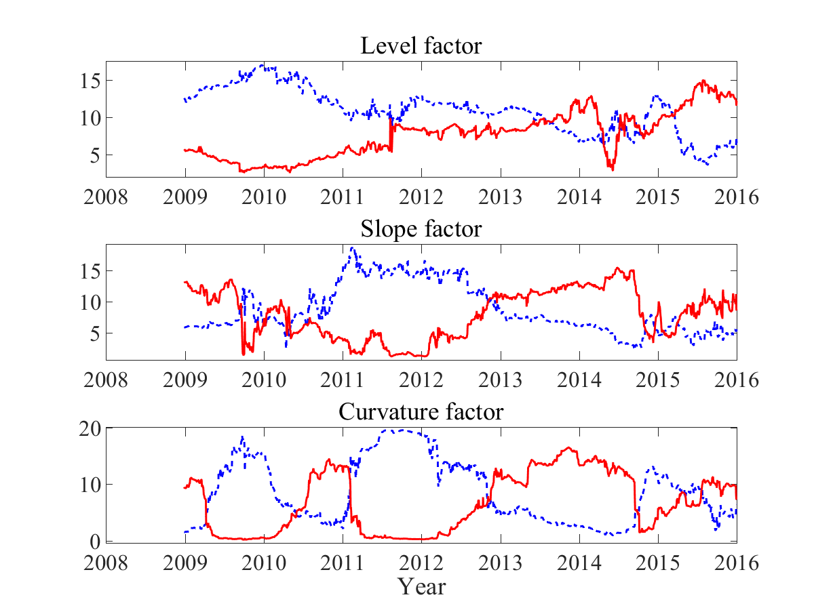

[](http://quantlet.de/)

## [](http://quantlet.de/) **DDINetwork_network_US_EU** [](http://quantlet.de/)

```yaml

Name of Quantlet : DDINetwork_network_US_EU

Published in : DDINetwork

Description : 'Group the dynamics of connectedness measures in US and European banks for level,
slope, curvature factor respectively.'

Keywords : 'factor analysis, factor-model, dynamic, factor, term structure, plot, parameter, pca,
autoregressive, default, estimation, regression, multivariate analysis, grouping'

See also : 'DDINetwork_CDS, DDINetwork_network_dynamic, DDINetwork_network_static,
DDINetwork_CDS_forecast'

Author : Xiu Xu

Submitted : Tue, Dec 27 2016 by Xiu Xu

Datafile : Bank.xlsx

```




### MATLAB Code:
```matlab
%% Figure 
clear all; clc;
load results_network_dynamic.mat
firmnum = 10;
rolling = 260;  
N       = 2088;
horizon = 12;  
plott   = 1;
usnum   = 5;

%% Level
group_net_Level_to    = [mean(squeeze(mean(net_Level(usnum + 1: firmnum, ...
                        1 : usnum, :), 1)), 1); 
                     	mean(squeeze(mean(net_Level(1 : usnum, ...
                        usnum + 1: firmnum,  :), 1)), 1)]';
periods               = size(group_net_Level_to, 1);
group_net_Level_in_us = zeros(periods, 1); 
for i = 1:usnum
    for j = 1:usnum
        if i ~= j
            group_net_Level_in_us = group_net_Level_in_us + squeeze(net_Level(i, j, :));
        end                       
    end
end
p = usnum;
group_net_Level_in_us = group_net_Level_in_us./p;
group_net_Level_in_eu = zeros(periods, 1); 
for i = usnum + 1 : firmnum
    for j = usnum + 1 : firmnum
        if i ~= j
            group_net_Level_in_eu = group_net_Level_in_eu + squeeze(net_Level(i, j, :));
        end                       
    end
end
p = firmnum - usnum;
group_net_Level_in_eu = group_net_Level_in_eu./p;
group_net_Level_in    = [group_net_Level_in_us group_net_Level_in_eu];
group_net_Level       = [group_net_Level_to  group_net_Level_in];

figure
subplot(3, 1, 1)
tm = 1 : 1:  N; 
plot(tm(rolling:N), group_net_Level(:, 1), 'b--', 'linewidth', 1.4);
hold on
plot(tm(rolling:N), group_net_Level(:, 2), 'r-', 'linewidth', 1.4);
Day = {'2008', '2009', '2010', '2011', '2012', '2013', '2014', '2015', '2016'};
set(gca, 'xtick', [1 263 524 785 1045 1306 1567 1828 2088]);
set(gca, 'xticklabel', Day);
xlim([1, N])
ylim([min(min(group_net_Level(:, 1:2))) - 0.5, max(max(group_net_Level(:, 1:2))) + 0.5])
h1 = ylabel('');
h  = title('Level factor');
set([h, h1], 'FontName', 'Times New Roman', 'FontSize', 16)
set(gca, 'FontName', 'Times New Roman', 'FontSize', 16)

%% Slope
group_net_Slope_to    = [mean(squeeze(mean(net_Slope(usnum + 1: firmnum, ...
                         1 : usnum, :), 1)), 1);
                         mean(squeeze(mean(net_Slope(1 : usnum, ...
                         usnum + 1: firmnum,  :), 1)), 1)]';
periods               = size(group_net_Slope_to, 1);
group_net_Slope_in_us = zeros(periods, 1); 
for i = 1:usnum
    for j = 1:usnum
        if i ~= j
            group_net_Slope_in_us = group_net_Slope_in_us + squeeze(net_Slope(i, j, :));
        end                       
    end
end
p                     = usnum;
group_net_Slope_in_us = group_net_Slope_in_us./p;
group_net_Slope_in_eu = zeros(periods, 1); 
for i = usnum + 1 : firmnum
    for j = usnum + 1 : firmnum
        if i ~= j
            group_net_Slope_in_eu = group_net_Slope_in_eu + squeeze(net_Slope(i, j, :));
        end                       
    end
end
p                     = firmnum - usnum;
group_net_Slope_in_eu = group_net_Slope_in_eu./p;
group_net_Slope_in    = [group_net_Slope_in_us group_net_Slope_in_eu];
group_net_Slope       = [group_net_Slope_to  group_net_Slope_in];

tm = 1 : 1:  N; 
subplot(3, 1, 2)
plot(tm(rolling:N), group_net_Slope(:, 1), 'b--', 'linewidth', 1.4);
hold on
plot(tm(rolling:N), group_net_Slope(:, 2), 'r-', 'linewidth', 1.4);
Day = {'2008', '2009', '2010', '2011', '2012', '2013', '2014', '2015', '2016'};
set(gca, 'xtick', [1 263 524 785 1045 1306 1567 1828 2088]);
set(gca, 'xticklabel', Day);
xlim([1, N])
ylim([min(min(group_net_Slope(:, 1:2))) - 0.5, max(max(group_net_Slope(:, 1:2))) + 0.5])
h1 = ylabel('');
h  = title('Slope factor');
set([h, h1], 'FontName', 'Times New Roman', 'FontSize', 16)
set(gca, 'FontName', 'Times New Roman', 'FontSize', 16)

%% Curva
group_net_Curva_to    = [mean(squeeze(mean(net_Curva(usnum + 1: firmnum, ...
                         1 : usnum, :), 1)), 1);
                         mean(squeeze(mean(net_Curva(1 : usnum, ...
                         usnum + 1: firmnum,  :), 1)), 1)]';
periods               = size(group_net_Curva_to, 1);
group_net_Curva_in_us = zeros(periods, 1); 
for i = 1 : usnum
    for j = 1 : usnum
        if i ~= j
            group_net_Curva_in_us = group_net_Curva_in_us + squeeze(net_Curva(i, j, :));
        end                       
    end
end
p                     = usnum;
group_net_Curva_in_us = group_net_Curva_in_us./p;
group_net_Curva_in_eu = zeros(periods, 1); 
for i = usnum + 1 : firmnum
    for j = usnum + 1 : firmnum
        if i ~= j
            group_net_Curva_in_eu = group_net_Curva_in_eu + squeeze(net_Curva(i, j, :));
        end                       
    end
end
p = firmnum - usnum;
group_net_Curva_in_eu = group_net_Curva_in_eu./p;
group_net_Curva_in    = [group_net_Curva_in_us group_net_Curva_in_eu];
group_net_Curva       = [group_net_Curva_to  group_net_Curva_in];

tm = 1 : 1:  N; 
subplot(3, 1, 3)
plot(tm(rolling:N), group_net_Curva(:, 1), 'b--', 'linewidth', 1.4);
hold on
plot(tm(rolling:N), group_net_Curva(:, 2), 'r-', 'linewidth', 1.4);
Day = {'2008', '2009', '2010', '2011', '2012', '2013', '2014', '2015', '2016'};
set(gca, 'xtick', [1 263 524 785 1045 1306 1567 1828 2088]);
set(gca, 'xticklabel', Day);
xlim([1, N])
ylim([min(min(group_net_Curva(:, 1:2))) - 0.5, max(max(group_net_Curva(:, 1:2))) + 0.5])
h1 = ylabel('');
h  = title('Curvature factor');
set([h, h1], 'FontName', 'Times New Roman', 'FontSize', 16)
set(gca, 'FontName', 'Times New Roman', 'FontSize', 16)
xlabel('Year');   
saveas(gcf, 'network_US_EU', 'png');

```
