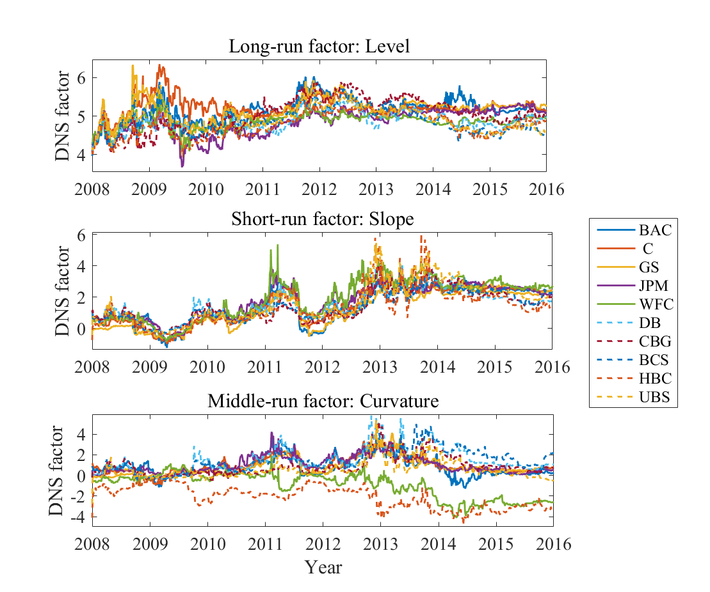

[](http://quantlet.de/)

## [](http://quantlet.de/) **DDINetwork_network_static** [](http://quantlet.de/)

```yaml

Name of Quantlet : DDINetwork_network_static

Published in : DDINetwork

Description : 'Estimate the level, slope, and curvature factor based on DNS model with the whole
data sample, and then calculate the network connectedness for each factor with variance
decomposition.'

Keywords : 'factor analysis, factor-model, term structure, plot, parameter, pca, autoregressive,
default, estimation, regression, multivariate analysis'

See also : 'DDINetwork_CDS, DDINetwork_network_US_EU, DDINetwork_network_dynamic,
DDINetwork_CDS_forecast'

Author : Xiu Xu

Submitted : Tue, Dec 27 2016 by Xiu Xu

Datafile : Bank.xlsx

```




### MATLAB Code:
```matlab
%% DNS model estimation
clear all;  
clc;
[data, d] = xlsread('Bank.xlsx', 'Bank_1', 'A4:K2091'); 
yname     = ['  m06';'  y01'; '  y02';'  y03';'  y04';'  y05';'  y07';'  y10';'  y20';'  y30']; 
maturity  = [ 6    12    24    36    48    60    84   120   240   360];
yn        = size(yname, 1);    % Number of maturities
firmnum   = 10;
N         = size(data, 1);
theta     = zeros(26, firmnum);
Level     = zeros(N, firmnum);
Slope     = zeros(N, firmnum);
Curva     = zeros(N, firmnum);
Yieldhat  = zeros(N*yn, 4*firmnum);
iplot     = 0;
for k = 1 : firmnum
    % read data
    [data, d] = xlsread('Bank.xlsx', ['Bank_' num2str(k)], 'A4:K2091');     
    CDS       = log(data);
    yield     = CDS;
    length    = size(yield, 1);
    % Kalman filter estimation
    global yy yn maturity K; 
    global mu fai AA BB DD sig omega lamda;
    global sigmat_t sigmat_lag ft_lag XNS;   
    K     = 3;             % Number of factors
    lamda = 0.0609;        % Initial value as Diebold & li(2006)
    c1    = ones(yn, 1);
    c2    = zeros(yn, 1);
    c3    = zeros(yn, 1);
    for i = 1:yn
        c2(i) = (1 - exp( - lamda*maturity(i)))/(lamda*maturity(i));
        c3(i) = c2(i) - exp( - lamda*maturity(i));
    end;
    CC = [c1 c2 c3];    
    AA = zeros(yn,1);  % Define coeffient in the measurement equation
    BB = CC;
    DD = eye(K);
    tX = 2;           
    NS = ((CC'*CC)\eye(size(CC, 2)))*CC'*yield';

    yy    = yield; 
    ns    = NS;
    nobs  = size(ns,2);
    nlags = 1;

    % Initial value of coefficients in measurement equation 
    X       = [ones(1, nobs - nlags); ns(:, 1 : nobs - nlags)]; 
    Y       = [ns(:,  nlags + 1 : nobs)];
    gamav   = (Y*X')/(X*X');
    mu      = gamav(:, 1);
    fai     = gamav(:, 2 : 4);
    omegav  = (Y - gamav*X)*(Y - gamav*X)'/(nobs-nlags);
    sigsq   = (yy(nlags + 1 : nobs, :)' - CC*NS(:, nlags + 1 : nobs))*(yy(nlags + 1 : nobs, :)' ...
              - CC*NS(:, nlags + 1:nobs))'/(nobs - nlags);  % var of measurement equation
    sig     = diag(sigsq);
    bigthet = [mu; reshape(fai, K^2, 1); diag(omegav); sig; lamda];

    % maximize likelihood
    warning off all;
    options  = optimset('Display', 'off', 'MaxIter', 1e+003, 'MaxFunEvals', ...
               1e+6, 'TolFun', 10^(-tX), 'TolX', 10^(-tX));
    thetstar = fminsearch('llfn_Kalman', bigthet, options); 
    fstar    = llfn_Kalman(thetstar);
    dns      = XNS(1 : 3, :)';
    
    T    = maturity(end);
    mat  = 1 : 1 : T; 
    pNS1 = ones(1, T); 
    pNS2 = zeros(1, T); 
    pNS3 = zeros(1, T);
    for imat = 1 : T;
        pNS2(imat) = (1 - exp(-lamda*imat))/(lamda*imat);
        pNS3(imat) = pNS2(imat) - exp(-lamda*imat);
    end;
    CCw = [pNS1; pNS2; pNS3]';  
    CC  = CCw(maturity', :);

    yieldhat = dns * CC';
    error    = yield - yieldhat;
    RSS      = mean(error.^2, 2);
    myield   = mean(yield, 2);
    TSS      = mean((yield - kron(ones(1, 10), myield)).^2, 2);
    R2       = 1 - RSS./TSS;
    RR       = std(error, 1);
    tstate   = NS';
    
    % Save results
    theta(:, k)                = thetstar;
    Yieldhat(:, 4*k - 3 : 4*k) = [reshape(yield, N*yn, 1) reshape(yieldhat, N*yn, 1) ...
                                  reshape(error, N*yn, 1) kron(ones(yn, 1), R2)];
                              
    Level(:, k) = dns(:, 1);
    Slope(:, k) = dns(:, 2);
    Curva(:, k) = dns(:, 3);    
    fprintf('k = %d \n', k);    
end
save('DNS_static')

%% DNS Figure 
clear all; clc;
load DNS_static.mat 
[N, firmnum] = size(Level);
tm           = 1 : 1 : N; 
figure
subplot(3, 1, 1)
plot(tm, Level(:, 1 : 5), '-', 'DisplayName', 'Slope', 'linewidth', 1.4);
hold on
plot(tm, Level(:, 6 : end), '--', 'DisplayName', 'Slope',   'linewidth', 1.4);
Day = {'2008', '2009', '2010', '2011', '2012', '2013', '2014', '2015', '2016'};
set(gca, 'xtick', [1 263 524 785 1045 1306 1567 1828 2088]);
set(gca, 'xticklabel', Day);
xlim([1, N])
ylim([min(min(Level)) - 0.12, max(max(Level)) + 0.12])
ylabel('DNS factor')
h = title('Long-run factor: Level');
set(h, 'FontName', 'Times New Roman', 'FontSize', 14);
set(gca, 'FontName', 'Times New Roman', 'FontSize', 14)

Slope1 = - Slope;
subplot(3, 1, 2)
plot(tm, Slope1(:, 1 : 5), '-', 'DisplayName','Slope', 'linewidth', 1.4);
hold on
plot(tm, Slope1(:, 6 : end), '--', 'DisplayName','Slope', 'linewidth', 1.4);
Day = {'2008', '2009', '2010', '2011', '2012', '2013', '2014', '2015', '2016'};
set(gca, 'xtick', [1 263 524 785 1045 1306 1567 1828 2088]);
set(gca, 'xticklabel', Day);
xlim([1, N])
ylim([min(min(Slope1)) - 0.12, max(max(Slope1)) + 0.12])
ylabel('DNS factor')
h = title('Short-run factor: Slope');
set(h, 'FontName', 'Times New Roman', 'FontSize', 14);
set(gca, 'FontName', 'Times New Roman', 'FontSize', 14)

subplot(3, 1, 3)
plot(tm, Curva(:, 1 : 5), '-', 'DisplayName','Slope', 'linewidth', 1.4);
hold on
plot(tm, Curva(:, 6 : end), '--', 'DisplayName','Slope', 'linewidth', 1.4);
Day = {'2008', '2009', '2010', '2011', '2012', '2013', '2014', '2015', '2016'};
set(gca, 'xtick', [1 263 524 785 1045 1306 1567 1828 2088]);
set(gca, 'xticklabel', Day);
xlim([1, N])
ylim([min(min(Curva)) - 0.12, max(max(Curva)) + 0.12])
ylabel('DNS factor')
xlabel('Year')
h = title('Middle-run factor: Curvature');
set(h, 'FontName', 'Times New Roman', 'FontSize', 14);
set(gca, 'FontName', 'Times New Roman', 'FontSize', 14)
Bankcode1 = [
            'BAC   ';
            ' C    ';
            'GS    ';
            'JPM   ';
            'WFC   ';
            'DB    ';
            'CBG   ';
            'BCS   ';
            'HBC   ';
            'UBS   '
            ];
legend(Bankcode1, 'Orientation', 'vertical' )  
saveas(gcf, 'DNS_factor', 'png');

% save statistics of factors in table      
stat1 = [mean(Level, 1)' std(Level, 1)' min(Level)' max(Level)' ACC(Level, 5)' ACC(Level, 10)'];
stat2 = [mean(Slope, 1)' std(Slope, 1)' min(Slope)' max(Slope)' ACC(Slope, 5)' ACC(Slope, 10)'];
stat3 = [mean(Curva, 1)' std(Curva, 1)' min(Curva)' max(Curva)' ACC(Curva, 5)' ACC(Curva, 10)'];

%% VAR variance decomposition
clear all; clc
load DNS_static.mat
clearvars -except Level Slope Curva folder
plott       = 0;
horizon     = 12;
[net_Level] = VARdecompfactor(Level, plott, horizon);        
[net_Slope] = VARdecompfactor(Slope, plott, horizon);  
[net_Curva] = VARdecompfactor(Curva, plott, horizon);   
net_Level
net_Slope
net_Curva
save('DNS_static_network')

```
